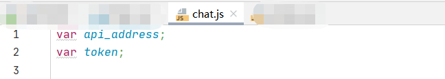

## 1、项目名称

chatgpt机器人

## 2、项目说明

chatgpt机器人整合了openAI接口，通过代理服务实现中美互联,  目前实现了智能问答，输入文本生成图片功能，目前是方便日常办公。会逐步往自动化商业文案、自动化商业视频演进。

##### Completed List

- 智能问答

- 输入文本生成图片

##### To Do List

- 根据文案生成短视频

- 文案视频合成

- 视频推送短视频平台

- 视频剪辑推送短视频平台

## 3、项目结构

### 3.1 后端部分

​	由java实现，代码仓库 [chatgpt-java]( https://github.com/zcg1011713962/chatgpt-java) 

#### 3.1.1 程序运行步骤说明

1. 拉取代码
```
   git clone  git@github.com:zcg1011713962/chatgpt-java.git
```
2. 修改配置

   chatgpt-zrun/src/main/resources/application.yml

   添加openai鉴权密钥 

   

​    3.运行启动类  com.chat.Main.java

### 3.2 前端部分 

​	由javascript、html、jquery、boodstrap实现，代码仓库 [chatgpt-boodstrap]( https://github.com/zcg1011713962/chatgpt-boodstrap)

#### 3.2.1 程序运行步骤说明

1.拉取代码
```
    git clone  git@github.com:zcg1011713962/chatgpt-boodstrap.git
```
2.修改配置

chatgpt-boodstrap/js/chat.js

```
var api_address // API接口地址 
```

```
var token // openai鉴权token
```



3.运行chatgpt-boodstrap/chat.html

##### 3.2.1 智能问答界面


##### 3.2.2 输入文本生成图片界面


